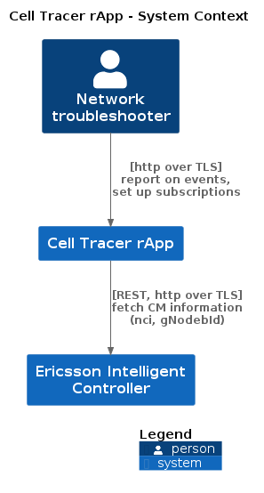
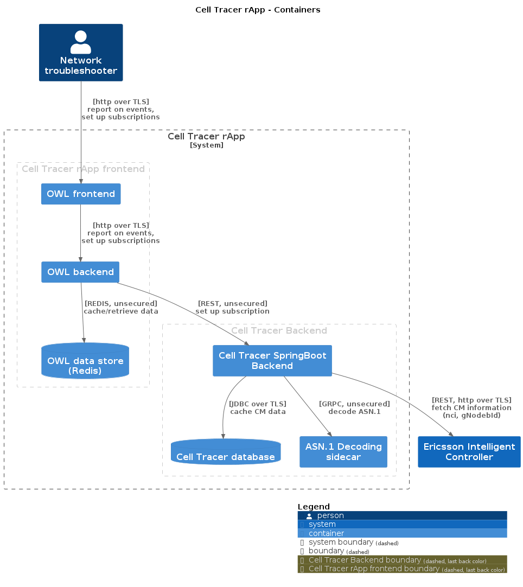
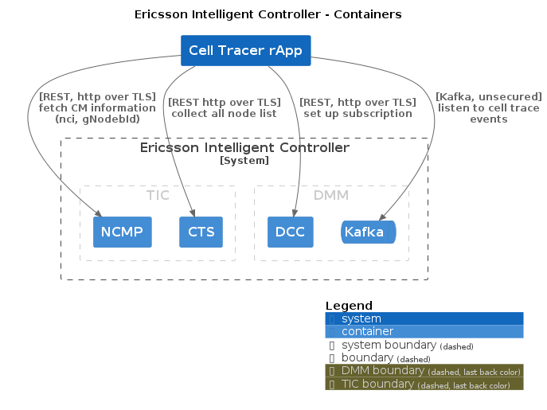
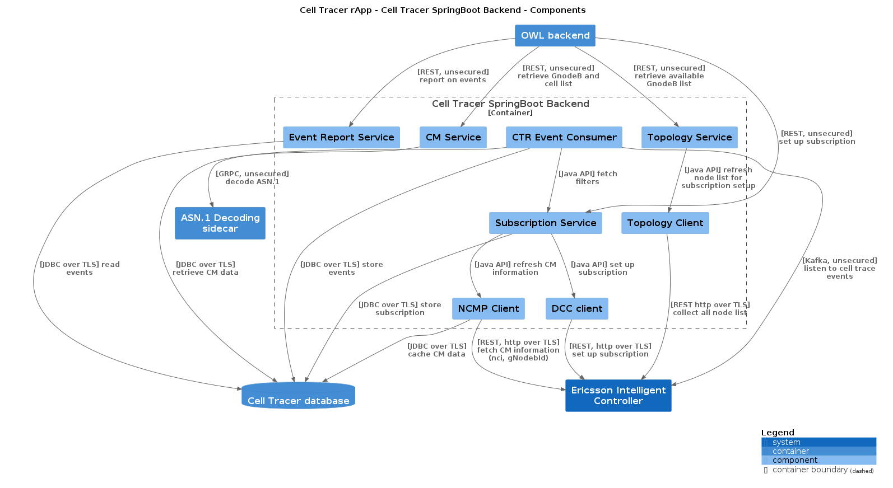

# Cell Tracer Architecture

<!--
Images were generated by [Structurizr](https://structurizr.com/).

To run use this tool locally run the following command:
`docker run -d --rm -p 8080:8080 -u $(id -u):$(id -g) -v <document_folder>:/usr/local/structurizr structurizr/lite`
where document_folder is the path to the folder containing the .dsl file.

To generate the images (plantuml format) run the following command:
docker run --rm -it -v $(pwd)/doc/Architecture_Overview:/docs extenda/structurizr-to-png
-->

## System view

A network troubleshooter interacts with EIC through the CEll Tracer UI. Two main use cases are covered:
- Report on network events
- Setup subscriptions

## Cell Tracer Container view

The rApp is organized in two blocks, a frontend (owl based) and a backend. 
Please refer to the following diagrams for details on the different blocks.
OWL employs a three tiered architecture with a frontend responsible for rendering output,
a backend responsible for REST calls to the application backend and a REDIS instance used as persistent cache.
It is currently deployed a single pod. The component view of OWL is out of scope of this documentation.

## EIC used Container view

The EIC services used by the CellTracer rApp:

## Component view (backend)

Cell Tracer rApp has a java backend and a Postgres database deployed as separate pods, 
and an optional sidecar for ASN.1 decoding.
The event consumer constantly fetches events from Kafka and loads then in the database
(see [Kafka Adapter](../../eric-oss-cell-tracer-poc-app/src/main/java/com/ericsson/oss/apps/kafka/consumer/NREventDataRetrieval.java)).
The service endpoints are mapped to the relative [controllers](../../eric-oss-cell-tracer-poc-app/src/main/java/com/ericsson/oss/apps/controller).

